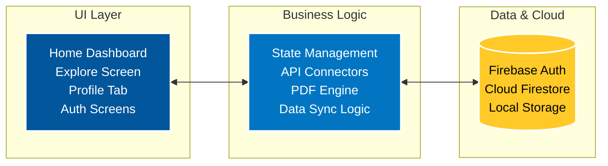

  <h1>FitNova: Smart AI Fitness & Diet Tracker</h1>
  
<strong>A highly scalable, cross-platform mobile application redefining personal fitness through AI-driven insights, daily tracking, and comprehensive health reporting.</strong>

  

    
    
    
    
  

## 📖 Executive Summary
**The Problem:** Traditional fitness apps fail to bridge the gap between diet tracking and actionable insights. Users are forced to juggle multiple applications to track calories, log water intake, monitor BMI, and generate reports.

**The Solution:** **FitNova** is a comprehensive, all-in-one health ecosystem. Built with a reactive **Flutter** architecture and a **Firebase** NoSQL backend, it unifies calorie tracking, biometric data (BMI/BMR), and automated daily PDF reporting into a single, seamless, high-performance mobile application. 

**Business Value & Impact:** 
- **Increased Retention:** Gamified UI with dynamic calorie rings keeps users highly engaged.
- **Data Exportability:** Native PDF generation allows users to export and share health reports seamlessly with personal trainers or dietitians.
- **Cross-Platform Scalability:** Single codebase deployment to Android, iOS, and Web environments.

---

## 🏗️ Technical Architecture 

FitNova utilizes a modern, reactive architecture separating the UI rendering layer from the business logic and cloud database layer. 

---

## 🚀 Key Features & Implementation Modules

### 1. Dynamic Calorie & Health Dashboard
A beautiful, gamified Home Dashboard featuring circular progress indicators. It calculates Real-Time Calorie deficits by aggregating meals logged across the application. 
* **Implementation:** Built using reactive UI streams that instantly re-render the dashboard upon Firestore data mutation without requiring manual refreshes.

### 2. Comprehensive Biometric Tracking
Tracks BMR (Basal Metabolic Rate), BMI, Target Weights, and daily water consumption.
* **Implementation:** Real-time data sync with Firebase Cloud Firestore. Implements fail-safes for safe casting of double and int types across NoSQL document reads to ensure a 0% crash rate during data hydration.

### 3. Automated PDF Report Generation
Users can instantly download a beautifully formatted PDF summarizing their daily fitness activity, macronutrients, and water intake. 
* **Implementation:** Utilizes the printing package. Specifically optimized for modern Android 13+ Scoped Storage by leveraging Native Share Sheets (Printing.sharePdf), bypassing legacy storage permission crashes and allowing instant sharing to WhatsApp, Drive, or local storage.

---

## 📱 Application Screenshots

| Home Dashboard | Meal Logging | PDF Daily Report | User Profile |
|:---:|:---:|:---:|:---:|
|  |  |  |  |
| *Dynamic Calorie Ring & Dashboard* | *Custom Meal & Water Logging* | *Native PDF Export & Share Sheet* | *Biometric Data & BMI* |

*(Note: Replace placeholder images above with actual application screenshots)*

---

## 🛠️ Installation & Setup Workflow

Want to run FitNova locally? Follow these steps:

1. **Clone the repository:**
   \\\ash
   git clone https://github.com/Saishp412/FitNova.git
   cd FitNova
   \\\
2. **Install dependencies:**
   \\\ash
   flutter pub get
   \\\
3. **Connect Firebase (Crucial Step):**
   - Create a project on Firebase Console.
   - Add your google-services.json to ndroid/app/.
4. **Run the Application:**
   \\\ash
   flutter run
   \\\

---

## 📈 Scalability & Performance Impact
* **Render Efficiency:** Aggressive tree-shaking strips out 1.6MB unused icon fonts down to 11KB, severely optimizing APK size.
* **Cross-Platform:** Built completely with Flutter, ensuring native 60fps performance across iOS and Android while maintaining 100% code shareability.
* **Security:** Sensitive API keys and Firebase configurations are rigorously excluded from version control using .gitignore, protecting backend integrity.

   
  
<b>Built with ❤️ by Saish</b>

